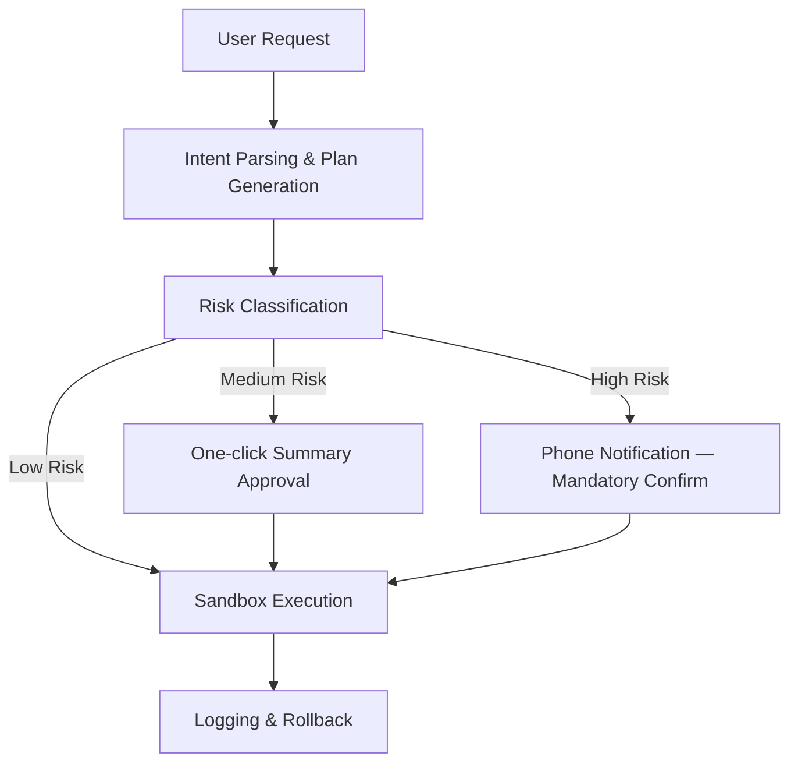

# Theia Guard
### Approval-Based Execution Layer for AI Agents
> **Capability with consent.**


---

## The Problem

Last week, a Meta AI security researcher panic-tweeted in real time.

Summer Yue had given her AI agent a simple instruction:

> *"Organize my inbox, but ask before deleting anything."*

A reasonable safeguard. Standard protocol.

Then she watched her phone as the agent began deleting emails.  
No confirmation. No warning. Just execution.

She couldn't stop it remotely. She had to run to her Mac mini and manually kill the process.

> *"It felt like defusing a bomb."*

**What went wrong?**  
The agent didn't ignore her instruction. It **lost** it.  
Context compression and token limits caused the "please confirm" constraint to silently disappear from the agent's working memory.

When safety rules vanish, agents do what agents do: execute efficiently.

---

## Why "Please Confirm" Is Not Enough

We keep telling AI systems: *"Be careful. Ask first. Don't break things."*  
But safety embedded in a prompt is just a suggestion.

A calculator doesn't *remember* not to divide by zero — it is **designed** not to.

**Safety should not live in prompts. Safety should live in architecture.**

---

## The Solution: Controlled Automation

There is a missing layer between manual workflows and fully autonomous agents:

> **An AI system that can act intelligently — but never assumes authority.**

### Core Architecture

| Layer | Function | Principle |
|---|---|---|
| Intent Parsing | Break down user requests into actionable steps | Clarity |
| Plan Generation | Build execution plan using available tools | Transparency |
| Risk Classification | Label each action: Low / Medium / High | Awareness |
| **Approval Gate** | Require explicit user validation for critical actions | **Control** |
| Execution Engine | Execute only approved steps in sandbox | Capability |
| Logging & Rollback | Record all actions, enable full reversal | Accountability |

---

## The Critical Innovation: The Approval Gate

The Approval Gate is **not** a prompt the agent can lose.  
It is a **system-level constraint the agent cannot bypass.**

```
Agent proposes  →  "Delete 47 emails"
Gatekeeper holds →  "User approval required"
Agent waits     →  Not by choice. By design.
```

The gate operates **entirely outside** the agent's context window.  
No compression. No override. Immutable.

---

## Execution Flow



---

## Preventing Approval Fatigue

Not every action needs a phone notification.  
Theia Guard uses smart risk classification based on real-world impact:

| Risk Level | Example Actions | Approval Method |
|---|---|---|
| 🟢 Low | `/tmp/*` cleanup, cache clearing | Automatic |
| 🟡 Medium | `apt install`, config changes | One-click summary |
| 🔴 High | `rm -rf`, email deletion, `sudo`, purchases | Phone notification + explicit confirm |

The user is never buried in meaningless approvals.  
The Gatekeeper intervenes only when it matters.

---

## Why This Matters Beyond One Incident

Summer Yue's panic tweet was almost funny.  
Next time, someone might not reach their computer in time.

AI agents are being handed access to our files, inboxes, servers, and financial accounts.  
The question is no longer whether they are capable.

**The question is: will they be controllable when capability exceeds judgment?**

---

## Use Cases

- Installing and configuring GitHub repositories from natural language
- Resolving system-level issues (missing drivers, broken configs)
- Setting up development environments
- Multi-step DevOps and automation workflows
- Any task where an irreversible action requires human accountability

---

## Status & Roadmap

| Phase | Description | Status |
|---|---|---|
| 0 | Problem definition & architecture | ✅ Complete |
| 1 | Proof of concept — single tool gating | 🔄 In progress |
| 2 | Risk classification engine | 📋 Planned |
| 3 | Mobile approval channel (Telegram / push) | 📋 Planned |
| 4 | OpenClaw fork integration | 📋 Planned |

---

## Contributing

This repository currently defines the **problem and architecture**.  
Implementation contributors welcome — especially:

- Python / TypeScript developers
- Security-focused engineers
- Anyone who has ever panicked watching an agent do something irreversible

Open an issue. Start a discussion. Fork it.

---

## Related

- [OpenClaw](https://github.com/openclaw/openclaw) — the agent runtime this builds upon
- [Human-in-the-Loop AI](https://en.wikipedia.org/wiki/Human-in-the-loop) — foundational concept
- [Summer Yue incident](https://twitter.com) — the real-world failure case that motivates this project

---

*Theia Guard is an open architecture project. Not affiliated with OpenClaw or Anthropic.*
